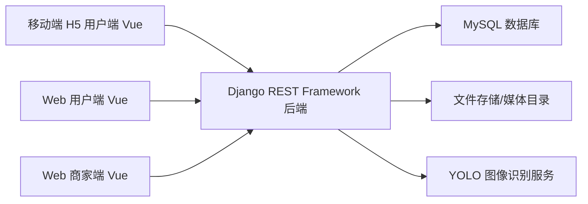
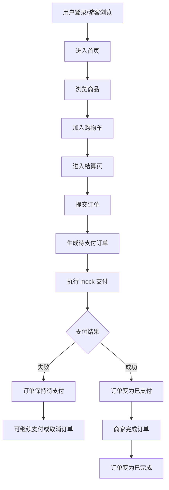
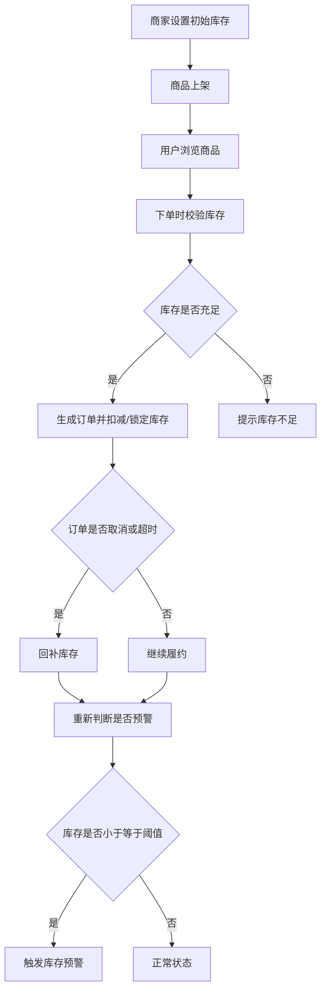
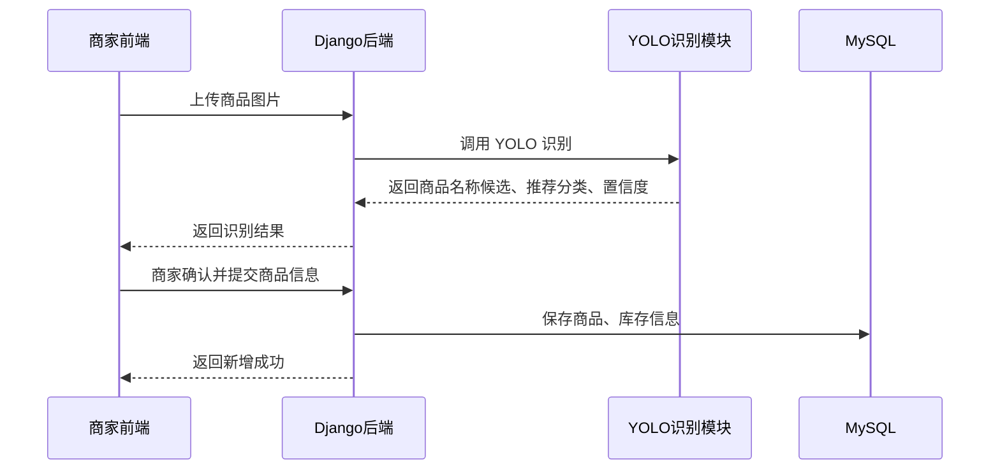
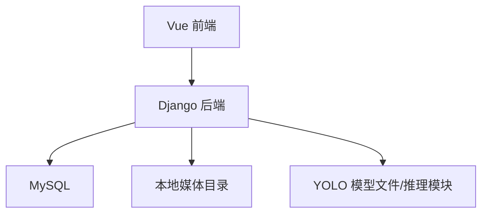

# 无人超市管理系统：系统架构设计文档

> 状态：当前实现版  
> 作用：用于描述系统整体结构、模块划分、前后端关系、核心调用链路和部署边界。

## 1. 文档用途

这份文档用于回答以下问题：

- 整个系统由哪些部分组成
- 移动端用户端、Web 端、后端、数据库、图像识别模块之间如何协作
- 用户角色与商家角色如何共享系统能力但保持权限隔离
- 系统的核心业务链路如何在架构层面落地

与其他文档的分工如下：

- `docs/prd/unmanned-store-prd.md`
  - 负责需求、用户故事、流程和验收标准
- `docs/design/database-design.md`
  - 负责数据库、类设计、E-R 图
- `docs/design/api-design.md`
  - 负责接口路径、参数、返回结构和权限边界
- `docs/design/system-architecture.md`
  - 负责整体架构、模块关系、调用链路和系统边界

## 2. 总体架构目标

本系统采用单体架构，目标是：

- 满足本科毕设的实现复杂度要求
- 保持业务模块完整
- 支持移动端 H5 用户界面和 Web 后台式界面
- 通过统一后端承载用户端与商家端业务
- 保留图像识别辅助录入能力，但不引入过重的分布式复杂度

## 3. 总体架构概览

### 架构说明

- 前端统一采用 `Vue 3` 技术栈
- 前端分为两套 UI 形态：
  - 移动端 H5 用户 UI
  - Web 后台式 UI
- Web 用户端与 Web 商家端共用后台式界面框架，通过角色区分菜单和权限
- 后端统一采用 `Django + DRF`
- 数据统一存储在 `MySQL`
- 商品图片、用户头像等文件先存储在本地媒体目录
- YOLO 作为辅助识别能力，由后端在商家上传图片时调用

## 4. 前端架构

## 4.1 前端总体设计

前端统一使用一套 `Vue 3` 技术栈，但分成两种界面形态：

- **移动端 H5 用户端**
  - 面向顾客购物流程
  - 强调浏览、购物车、结算、订单管理
  - 导航方式：顶部 + 底部导航

- **Web 后台式界面**
  - 面向 Web 用户端和 Web 商家端
  - 统一左侧导航栏 + 顶部栏布局
  - 通过角色区分菜单项和页面权限

## 4.2 前端模块划分

### 移动端 H5 用户端模块
- 登录注册
- 首页
- 商品浏览
- 商品详情
- 购物车
- 结算
- 我的订单
- 个人中心

### Web 用户端模块
- 首页
- 商品浏览
- 购物车
- 我的订单
- 个人中心

### Web 商家端模块
- 控制台
- 商品管理
- 分类管理
- 库存管理
- 订单管理
- 公告管理
- 推荐位管理
- 销售统计

## 5. 后端架构

## 5.1 后端总体设计

后端采用单体应用结构，由统一服务承载所有业务模块：

- 用户认证
- 商品管理
- 库存管理
- 购物车
- 订单管理
- 公告与推荐位
- 图像识别辅助录入

## 5.2 Django app 建议划分

- `users`
  - 用户、登录、注册、资料、地址
- `products`
  - 商品、分类、商品上下架
- `inventory`
  - 库存、库存预警、库存日志
- `cart`
  - 购物车、购物车项
- `orders`
  - 订单、订单项、订单状态流转
- `content`
  - 公告、推荐位
- `vision`
  - 图像上传、YOLO 识别调用

## 5.3 权限架构

权限分成两层：

- **角色权限**
  - `user`
  - `merchant`

- **对象权限**
  - 用户只能访问自己的购物车和订单
  - 商家可访问后台商品、库存、统计和所有订单管理接口

## 6. 核心业务链路

## 6.1 用户购物链路

### 架构层说明

- 前端负责展示页面和交互
- 后端负责库存校验、订单生成、状态流转
- 数据库负责持久化订单、库存和商品快照

## 6.2 库存流转链路

### 架构层说明

- 库存是商品、购物车、订单和商家运营之间的连接点
- 库存预警能力依赖库存模块独立设计
- 库存日志记录由后端服务统一写入

## 6.3 图像识别辅助上架链路

### 架构层说明

- YOLO 只负责辅助识别
- 商品最终是否保存、上架，仍由商家人工确认决定
- 图像识别不是独立业务主链，而是商家商品录入的增强能力

## 7. 数据架构

系统数据分为五类：

- 用户数据
  - 用户、地址、头像
- 商品数据
  - 商品、分类、图片、上下架状态
- 库存数据
  - 当前库存、阈值、库存日志
- 交易数据
  - 购物车、订单、订单项、支付状态
- 内容数据
  - 公告、推荐位

## 8. 部署架构建议

对于毕设实现，建议采用最简单可行部署结构：

### 部署建议

- 前端与后端可分开启动
- `Vue` 负责页面和接口调用
- `Django` 提供 REST API
- `MySQL` 持久化业务数据
- 图片先保存在本地目录
- `YOLO` 可先作为本地推理模块集成进后端服务

## 9. 非功能性设计考虑

## 9.1 可维护性

- 业务模块按 app 拆分
- 接口与模型命名统一
- 数据结构提前保留地址扩展能力

## 9.2 可扩展性

系统当前按毕设范围收敛，但保留以下扩展方向：

- 地址管理全面启用
- 配送场景
- 售后与退款
- 商品评价
- 更复杂的推荐策略
- 更完整的图像识别记录与分析

## 9.3 安全性

- 登录态使用 `JWT`
- 密码使用哈希保存
- 商家接口必须做角色权限校验
- 用户订单接口必须做对象权限校验

## 10. 架构设计结论

本系统采用：

- 一套 `Vue 3` 技术体系
- 两套 UI 形态
- 一个 `Django + DRF` 单体后端
- 一个 `MySQL` 数据库
- 一个 `YOLO` 辅助识别能力

这种架构满足以下目标：

- 足够完整，适合毕设展示
- 复杂度可控，便于实际落地
- 用户端、商家端和智能识别亮点都能覆盖

## 11. 后续可继续补充

- 前端目录结构设计
- Django 项目目录结构设计
- 权限实现草案
- 部署步骤文档
- 开发阶段划分与实施顺序
