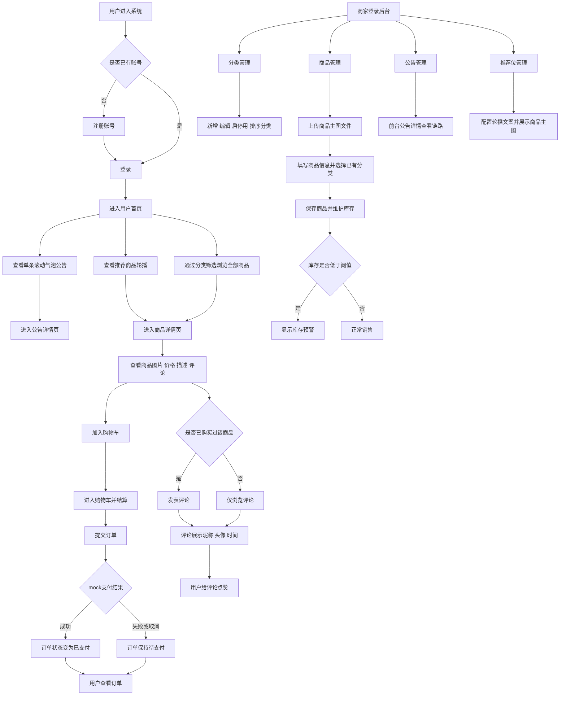
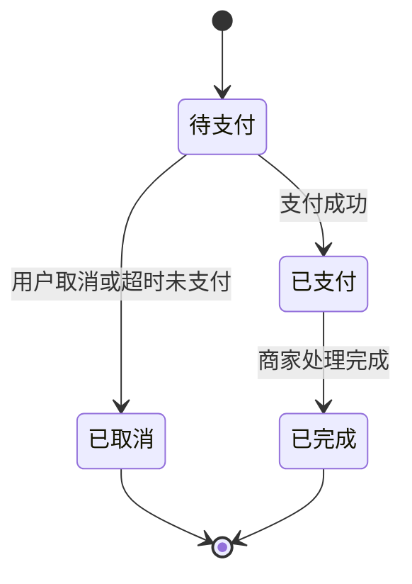

# 产品需求文档：无人超市管理系统 - V2

## 1. 综述
### 1.1 项目背景与核心问题
本项目是一个本科毕业设计，目标是设计并实现一个不依赖硬件设备的无人超市管理系统。系统聚焦软件层业务闭环，覆盖顾客自助购物与商家后台管理两类核心场景。

V1 版本已完成基础业务链路，但在实际联调与页面审视中暴露出一批影响演示质量与产品完整度的问题：

- 商家商品主图录入方式不合理，当前允许手输图片链接，不符合实际后台使用习惯
- 用户头像没有在左侧导航栏与顶部导航栏稳定展示
- 商家分类管理能力缺失，导致商品新增时分类依赖不完整
- 首页公告标题缺乏有效交互，无法进入完整公告内容
- 用户首页商品曝光不足，不能直接看到全部商品
- 推荐商品展示形式不够突出，不利于运营展示
- 商品详情页与评论能力缺失，用户缺乏更完整的浏览与互动体验
- Web 用户端与移动端 H5 均缺少用户注册入口

因此，V2 的目标是在不推翻既有业务主线的前提下，补齐用户注册、首页商品发现、公告详情、商品详情、评论互动、头像展示、商品图片上传与分类管理等关键能力，使系统更接近完整可演示的电商原型。

### 1.2 核心业务流程 / 用户旅程地图
1. **阶段一：用户进入系统** - 用户注册、登录并进入首页，完成头像展示与账号态建立
2. **阶段二：用户首页与商品发现** - 用户在首页查看滚动公告、轮播推荐、分类筛选和全部商品列表
3. **阶段三：商品详情与互动** - 用户进入商品详情页，查看商品信息并基于已购身份发表评论与点赞
4. **阶段四：购物结算与订单管理** - 用户加入购物车、提交订单、完成 mock 支付并查看订单状态
5. **阶段五：商家商品与分类管理** - 商家维护分类、上传商品主图文件、管理商品上下架与库存预警
6. **阶段六：公告与推荐运营** - 商家维护公告内容、推荐商品与轮播文案，前台完成公告详情与推荐轮播展示

### 1.3 Mermaid 图（流程 / 状态）
#### 1.3.1 用户操作流（必填）


#### 1.3.2 订单状态机


## 2. 用户故事详述

### 阶段一：用户进入系统

---

#### **US-01：作为顾客，我希望能够注册或登录系统并展示个人头像，以便快速进入系统开始购物**
* **价值陈述 (Value Statement)**:
  * **作为** 顾客
  * **我希望** 可以注册、登录并在系统中看到自己的头像
  * **以便于** 快速建立账号身份并进入购物流程
* **业务规则与逻辑 (Business Logic)**:
  1. **前置条件**:
     - 用户可选择注册、登录或游客浏览
  2. **操作流程 (Happy Path)**:
     - Web 用户端与移动端 H5 都必须提供注册入口
     - 注册表单字段为：用户名、手机号、密码、确认密码
     - 登录方式保持现状，不修改既有登录方式
     - 注册成功后系统自动完成登录，并进入用户首页
     - 头像不在注册表单内填写，而在注册/登录成功后通过个人中心维护
     - 当前登录用户头像必须展示在左侧导航栏用户信息区与顶部导航栏右侧用户区
     - 当用户未上传头像时，系统展示默认头像占位
  3. **异常处理 (Error Handling)**:
     - 用户名已存在：提示“用户名已存在，请更换后重试”
     - 手机号已存在：提示“手机号已被注册”
     - 密码与确认密码不一致：提示“确认密码与密码不一致”
     - 注册信息不完整：提示用户补全必填项
     - 用户头像加载失败：显示默认头像，不影响继续使用系统
* **验收标准 (Acceptance Criteria)**:
  * **场景 1：用户注册成功并自动进入首页**
    * **GIVEN** 用户尚未注册
    * **WHEN** 用户在 Web 端或移动端填写合法注册信息并提交
    * **THEN** 系统创建账号、自动登录并跳转到用户首页
  * **场景 2：未上传头像用户登录后展示默认头像**
    * **GIVEN** 用户已注册但未上传头像
    * **WHEN** 用户登录系统
    * **THEN** 左侧导航栏和顶部导航栏均展示默认头像
  * **场景 3：已上传头像用户登录后展示真实头像**
    * **GIVEN** 用户已上传头像
    * **WHEN** 用户登录系统
    * **THEN** 左侧导航栏和顶部导航栏均展示当前用户头像
* **页面布局线框图 (ASCII Wireframe)**:
```text
+----------------------------------------------------------------------------------+
| 顶部栏：无人超市用户端                                      [消息] [头像][昵称]   |
+----------------------+-----------------------------------------------------------+
| 左侧导航用户卡片     | 登录 / 注册页 或 首页壳                                   |
| +------------------+ |-----------------------------------------------------------|
| |      头像        | | 登录页：                                                  |
| | 用户昵称/手机号  | | [用户名/手机号]                                           |
| | [个人中心]       | | [密码]                                                    |
| +------------------+ | [登录]                         [去注册]                    |
| [首页]              |                                                           |
| [商品浏览]          | 注册页：                                                  |
| [购物车]            | [用户名]                                                  |
| [我的订单]          | [手机号]                                                  |
| [个人中心]          | [密码]                                                    |
|                     | [确认密码]                                                |
|                     | [注册并进入首页]                 [返回登录]                |
+----------------------+-----------------------------------------------------------+
```

### 阶段二：用户首页与商品发现

---

#### **US-02：作为顾客，我希望在首页直接看到公告、推荐商品和全部商品，以便快速发现感兴趣的商品**
* **价值陈述 (Value Statement)**:
  * **作为** 顾客
  * **我希望** 进入首页后就能直接浏览公告、推荐商品和全部商品
  * **以便于** 更高效地发现商品并进入购买流程
* **业务规则与逻辑 (Business Logic)**:
  1. **前置条件**:
     - 用户已进入首页，可为登录态或游客态
  2. **操作流程 (Happy Path)**:
     - 首页从上到下布局为：单条滚动气泡公告、推荐商品轮播图、分类筛选、全部商品列表
     - 首页默认直接展示全部商品，不要求用户先跳转独立商品页
     - 分类筛选位于商品列表上方，用于对全部商品列表进行筛选
     - 推荐商品采用轮播图展示，点击轮播项后进入对应商品详情页
     - 公告采用单条滚动气泡形式展示，点击后进入公告详情页
  3. **异常处理 (Error Handling)**:
     - 公告为空：公告区显示“暂无公告”
     - 推荐商品为空：轮播区显示默认占位，不影响商品列表展示
     - 商品列表为空：显示“暂无商品”
     - 某分类下无商品：提示“该分类暂无商品”
* **验收标准 (Acceptance Criteria)**:
  * **场景 1：首页默认展示全部商品**
    * **GIVEN** 系统中存在已上架商品
    * **WHEN** 用户进入首页
    * **THEN** 用户无需额外跳转即可在首页看到全部商品列表
  * **场景 2：点击公告进入公告详情**
    * **GIVEN** 首页存在滚动气泡公告
    * **WHEN** 用户点击公告气泡
    * **THEN** 系统进入对应公告详情页
  * **场景 3：点击推荐轮播进入商品详情**
    * **GIVEN** 首页存在推荐商品轮播
    * **WHEN** 用户点击某个轮播项
    * **THEN** 系统进入对应商品详情页
* **页面布局线框图 (ASCII Wireframe)**:
```text
+----------------------------------------------------------------------------------+
| 顶部栏：无人超市用户端                                 [搜索框]      [头像][昵称] |
+----------------------+-----------------------------------------------------------+
| 左侧导航用户卡片     | 首页                                                      |
| [头像][昵称]         |-----------------------------------------------------------|
| [首页]               | ( 气泡公告：今日饮品限时优惠，点击查看详情... >>> )        |
| [商品浏览]           |-----------------------------------------------------------|
| [购物车]             | [ 推荐商品轮播图 1 / 2 / 3 ]                              |
| [我的订单]           | [商品图 + 文案] [商品图 + 文案] [商品图 + 文案]            |
| [个人中心]           |-----------------------------------------------------------|
|                      | 分类筛选：[全部] [饮料] [零食] [日用品] [更多]            |
|                      |-----------------------------------------------------------|
|                      | 全部商品列表                                               |
|                      | +-----------+ +-----------+ +-----------+                |
|                      | | 商品图    | | 商品图    | | 商品图    |                |
|                      | | 名称      | | 名称      | | 名称      |                |
|                      | | 价格      | | 价格      | | 价格      |                |
|                      | | [详情]    | | [详情]    | | [详情]    |                |
|                      | +-----------+ +-----------+ +-----------+                |
+----------------------+-----------------------------------------------------------+
```

### 阶段三：商品详情与互动

---

#### **US-03：作为顾客，我希望查看商品详情并在已购买后发表评论，以便更充分地了解商品并进行互动**
* **价值陈述 (Value Statement)**:
  * **作为** 顾客
  * **我希望** 能查看商品详情、浏览评论，并在已购买后发表评论和点赞
  * **以便于** 获得更完整的商品信息和用户反馈参考
* **业务规则与逻辑 (Business Logic)**:
  1. **前置条件**:
     - 用户已进入某商品详情页
  2. **操作流程 (Happy Path)**:
     - 商品详情页展示商品图片、名称、价格、描述、库存信息与评论区
     - 只有已购买过该商品的用户才允许发表评论
     - 同一用户对同一商品可以多次评论
     - 评论展示字段为：评论文字、评论时间、评论用户昵称、评论用户头像
     - 评论不做星级评分
     - 评论列表排序规则为：先按点赞数从高到低，再按评论时间倒序
     - 用户可以对评论点赞
  3. **异常处理 (Error Handling)**:
     - 未购买用户点击发表评论：提示“购买后才可评论”
     - 评论内容为空：提示“请输入评论内容”
     - 商品已下架：仍可查看历史详情页信息，但不可继续购买
     - 评论列表为空：显示“暂无评论，欢迎首评”
  4. **待确认项**:
     - 评论点赞是否需要登录态校验，当前版本仅确认“支持点赞”
* **验收标准 (Acceptance Criteria)**:
  * **场景 1：已购买用户成功发表评论**
    * **GIVEN** 用户已购买过某商品
    * **WHEN** 用户在商品详情页输入评论内容并提交
    * **THEN** 评论成功发布并出现在评论区
  * **场景 2：未购买用户不可评论**
    * **GIVEN** 用户未购买过某商品
    * **WHEN** 用户尝试发表评论
    * **THEN** 系统提示“购买后才可评论”
  * **场景 3：评论按点赞数和时间排序**
    * **GIVEN** 商品下存在多条评论
    * **WHEN** 用户打开评论区
    * **THEN** 系统优先展示点赞数更高的评论，点赞数相同时展示更新时间更近的评论
* **页面布局线框图 (ASCII Wireframe)**:
```text
+----------------------------------------------------------------------------------+
| 顶部栏：无人超市用户端                                      [头像][昵称]          |
+----------------------+-----------------------------------------------------------+
| 左侧导航用户卡片     | 商品详情页                                                |
| [头像][昵称]         |-----------------------------------------------------------|
| [首页]               | +-------------------+  商品名称                           |
| [商品浏览]           | |      商品大图      |  ￥价格                             |
| [购物车]             | |                   |  库存状态 / 分类 / 描述             |
| [我的订单]           | +-------------------+  [加入购物车]                       |
| [个人中心]           |-----------------------------------------------------------|
|                      | 评论区                                                     |
|                      | [发表评论输入框.................................][提交]      |
|                      | 提示：仅已购买用户可评论                                   |
|                      |-----------------------------------------------------------|
|                      | [头像] 昵称A   2026-03-10 10:00   [点赞 12]                |
|                      | 评论内容......                                             |
|                      |-----------------------------------------------------------|
|                      | [头像] 昵称B   2026-03-09 18:30   [点赞 5]                 |
|                      | 评论内容......                                             |
+----------------------+-----------------------------------------------------------+
```

### 阶段四：购物结算与订单管理

---

#### **US-04：作为顾客，我希望完成购物车结算和订单管理，以便追踪购买过程与结果**
* **价值陈述 (Value Statement)**:
  * **作为** 顾客
  * **我希望** 能从商品详情进入购物车、结算并查看订单状态
  * **以便于** 完成完整购买闭环
* **业务规则与逻辑 (Business Logic)**:
  1. **前置条件**:
     - 用户已选择待购买商品
  2. **操作流程 (Happy Path)**:
     - 用户可将商品加入购物车后进入结算页
     - 提交订单后先生成待支付订单
     - 支付采用 mock 流程
     - 用户可查看待支付、已支付、已完成、已取消等订单状态
  3. **异常处理 (Error Handling)**:
     - 库存不足：提示重新确认购物车
     - 支付失败或取消：订单保持待支付
     - 待支付订单超时：订单变为已取消
* **验收标准 (Acceptance Criteria)**:
  * **场景 1：提交订单后支付成功**
    * **GIVEN** 商品库存充足
    * **WHEN** 用户提交订单并完成 mock 支付
    * **THEN** 订单状态更新为已支付
  * **场景 2：取消待支付订单**
    * **GIVEN** 用户存在待支付订单
    * **WHEN** 用户取消订单
    * **THEN** 订单状态更新为已取消
* **页面布局线框图 (ASCII Wireframe)**:
```text
+----------------------------------------------------------------------------------+
| 顶部栏：无人超市用户端                                      [头像][昵称]          |
+----------------------+-----------------------------------------------------------+
| 左侧导航用户卡片     | 我的订单                                                  |
| [头像][昵称]         |-----------------------------------------------------------|
| [首页]               | [全部] [待支付] [已支付] [已完成] [已取消]                |
| [商品浏览]           |-----------------------------------------------------------|
| [购物车]             | 订单号     状态     商品摘要      金额      时间      操作  |
| [我的订单]           | 202603...  待支付   2件商品       ￥32      03-10     支付  |
| [个人中心]           | 202603...  已支付   1件商品       ￥12      03-09     详情  |
+----------------------+-----------------------------------------------------------+
```

### 阶段五：商家商品与分类管理

---

#### **US-05：作为商家，我希望管理分类、上传商品主图文件并维护商品信息，以便更规范地完成商品上架**
* **价值陈述 (Value Statement)**:
  * **作为** 商家
  * **我希望** 能先维护分类，再基于文件上传方式创建和管理商品
  * **以便于** 让商品管理更符合真实后台使用方式
* **业务规则与逻辑 (Business Logic)**:
  1. **前置条件**:
     - 商家已登录后台管理系统
  2. **操作流程 (Happy Path)**:
     - 分类管理页必须支持：查看分类列表、新增分类、编辑分类、启用/禁用分类、分类排序
     - 商品主图只能通过上传图片文件设置，不允许手工输入图片链接
     - 若保留图像识别能力，其输入源只能是商家上传的图片文件
     - 商家新增商品时，分类必须从已有可用分类中选择
     - 不允许在商品新增表单中临时创建分类
     - 商品仍支持上架、下架、库存设置与预警阈值设置
  3. **异常处理 (Error Handling)**:
     - 未上传图片文件：提示“请上传商品主图”
     - 分类为空：提示“请先创建分类后再新增商品”
     - 分类被禁用：商品表单中不可选择该分类
     - 上传失败：提示重新上传图片
* **验收标准 (Acceptance Criteria)**:
  * **场景 1：商家先创建分类再新增商品**
    * **GIVEN** 系统中暂无可用分类
    * **WHEN** 商家尝试新增商品
    * **THEN** 系统提示先进入分类管理页新增分类
  * **场景 2：商品主图必须通过文件上传**
    * **GIVEN** 商家进入商品新增页
    * **WHEN** 商家录入商品信息
    * **THEN** 商品主图字段只能选择上传文件，不能直接填写图片 URL
  * **场景 3：分类支持启用/禁用与排序**
    * **GIVEN** 商家已创建多个分类
    * **WHEN** 商家调整分类状态或排序
    * **THEN** 分类列表与前台筛选顺序同步更新
* **页面布局线框图 (ASCII Wireframe)**:
```text
+----------------------------------------------------------------------------------+
| 顶部栏：商家端管理后台                                      [头像][商家昵称]      |
+----------------------+-----------------------------------------------------------+
| 左侧导航             | 分类管理页                                                |
| [控制台]             |-----------------------------------------------------------|
| [商品管理]           | [新增分类]                                                |
| [分类管理]           | 分类名称    排序    状态      操作                         |
| [库存管理]           | 饮料        1       启用      编辑/禁用/上移下移          |
| [公告管理]           | 零食        2       启用      编辑/禁用/上移下移          |
| [推荐管理]           |-----------------------------------------------------------|
|                      | 商品新增/编辑页                                            |
|                      | [上传商品主图文件]                                         |
|                      | [商品名称]  [所属分类(下拉选择已有分类)]                   |
|                      | [价格]      [库存]      [预警阈值]                         |
|                      | [描述.................................................]    |
|                      | [保存商品]                                                |
+----------------------+-----------------------------------------------------------+
```

### 阶段六：公告与推荐运营

---

#### **US-06：作为商家和顾客，我希望公告和推荐位既能被后台配置，也能在前台形成有效跳转，以便提升运营展示效果**
* **价值陈述 (Value Statement)**:
  * **作为** 商家和顾客
  * **我希望** 公告和推荐内容在前后台形成完整链路
  * **以便于** 提升首页运营展示与内容触达效果
* **业务规则与逻辑 (Business Logic)**:
  1. **前置条件**:
     - 商家已维护公告与推荐商品
  2. **操作流程 (Happy Path)**:
     - 首页公告采用单条滚动气泡公告
     - 点击公告气泡后进入独立公告详情页
     - 后台公告管理原有新增、编辑、发布/下线能力沿用
     - V2 重点补齐前台公告详情查看链路
     - 推荐商品前台展示改为轮播图
     - 推荐轮播项点击后进入商品详情页
     - 推荐轮播后台配置继续基于推荐商品管理
     - 推荐轮播封面图直接使用商品主图
     - 推荐轮播支持商家在电脑端填写单独的轮播文案
  3. **异常处理 (Error Handling)**:
     - 公告详情不存在或已下线：提示“公告不存在或已下线”
     - 推荐商品已下架：推荐位自动不展示该商品
     - 推荐文案为空：前台仅展示商品图与商品名称
* **验收标准 (Acceptance Criteria)**:
  * **场景 1：公告气泡进入详情页**
    * **GIVEN** 首页存在一条已发布公告
    * **WHEN** 用户点击滚动气泡公告
    * **THEN** 系统进入该公告详情页并展示完整内容
  * **场景 2：推荐轮播展示商品主图与文案**
    * **GIVEN** 商家已配置推荐商品和轮播文案
    * **WHEN** 用户进入首页
    * **THEN** 系统以轮播形式展示商品主图和运营文案
  * **场景 3：点击推荐轮播进入商品详情**
    * **GIVEN** 首页存在推荐轮播项
    * **WHEN** 用户点击某个推荐轮播项
    * **THEN** 系统进入对应商品详情页
* **页面布局线框图 (ASCII Wireframe)**:
```text
+----------------------------------------------------------------------------------+
| 首页公告与推荐区域                                                               |
|----------------------------------------------------------------------------------|
| ( 气泡公告：新品上架，点击查看详情 >>> )                                         |
|----------------------------------------------------------------------------------|
| 推荐商品轮播                                                                     |
| +---------------------------------------------------------------------------+    |
| | [商品主图]                  轮播文案标题                                  |    |
| |                           轮播文案描述...                                 |    |
| |                           [查看商品详情]                                  |    |
| +---------------------------------------------------------------------------+    |
+----------------------------------------------------------------------------------+
```

### 阶段七：注册入口补齐

---

#### **US-07：作为新用户，我希望在 Web 用户端和移动端 H5 都能找到注册入口，以便顺利创建账号并直接开始使用系统**
* **价值陈述 (Value Statement)**:
  * **作为** 新用户
  * **我希望** 在两个用户端都能找到注册入口并完成注册
  * **以便于** 降低首次使用门槛
* **业务规则与逻辑 (Business Logic)**:
  1. **前置条件**:
     - 用户尚未登录
  2. **操作流程 (Happy Path)**:
     - Web 用户端登录页必须提供注册入口
     - 移动端 H5 也必须提供注册入口
     - 注册表单字段沿用：用户名、手机号、密码、确认密码
     - 注册成功后，两个端都自动登录并进入用户首页
  3. **异常处理 (Error Handling)**:
     - 注册信息校验失败：提示具体字段错误
     - 手机号或用户名重复：提示用户修改后重试
* **验收标准 (Acceptance Criteria)**:
  * **场景 1：Web 端注册成功**
    * **GIVEN** 用户打开 Web 用户端登录页
    * **WHEN** 用户点击注册入口并完成注册
    * **THEN** 系统自动登录并进入用户首页
  * **场景 2：移动端注册成功**
    * **GIVEN** 用户打开移动端 H5
    * **WHEN** 用户点击注册入口并完成注册
    * **THEN** 系统自动登录并进入用户首页
* **页面布局线框图 (ASCII Wireframe)**:
```text
+--------------------------------------------------+
| 登录 / 注册（移动端 H5）                         |
|--------------------------------------------------|
| [用户名 / 手机号]                                |
| [密码]                                           |
| [登录]                                           |
| 没有账号？[立即注册]                             |
|--------------------------------------------------|
| 注册页                                            |
| [用户名]                                         |
| [手机号]                                         |
| [密码]                                           |
| [确认密码]                                       |
| [注册并进入首页]                                 |
+--------------------------------------------------+
```

## 3. V2 版本重点变更摘要

- 商品主图由“手工输入图片链接”改为“上传图片文件”
- 用户头像明确要求在左侧导航栏和顶部导航栏同时展示
- 商家分类管理页补齐新增、编辑、启停用、排序能力
- 首页公告改为单条滚动气泡公告，并新增公告详情页链路
- 首页默认直接展示全部商品，分类筛选位于商品列表上方
- 推荐商品从静态列表改为轮播图，支持商家填写轮播文案
- 商品详情页补齐评论与点赞能力，且仅已购用户可评论
- Web 用户端和移动端 H5 都必须提供注册入口

