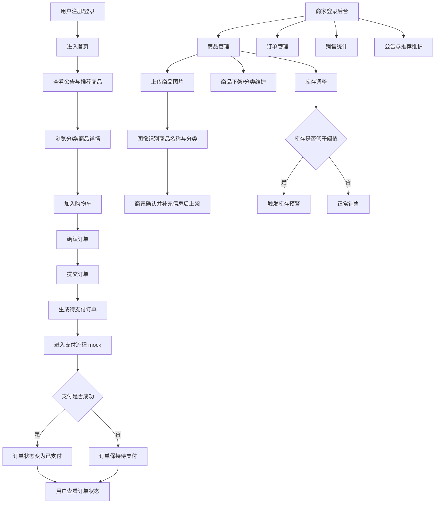
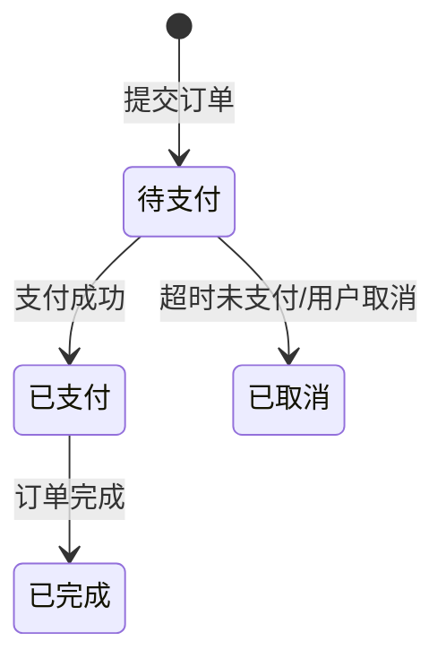

# 产品需求文档：无人超市管理系统

> 状态：已定稿

## 1. 综述

### 1.1 项目背景与目标
本项目是一个本科毕业设计，目标是设计并实现一个不依赖硬件设备的无人超市管理系统。系统聚焦软件层业务闭环，覆盖顾客自助购物与商家后台管理两类核心场景。

系统采用双端设计：
- 用户端：支持移动端 H5 与 Web 端
- 商家端：支持 Web 端

其中：
- 移动端用户端强调购物体验
- Web 用户端与 Web 商家端采用统一后台式界面，通过角色与权限区分功能范围

本项目的核心亮点包括：
- 公告推荐
- 库存预警
- 商品上架时的图像识别辅助录入

### 1.2 核心业务流程 / 用户旅程地图
1. **用户进入系统**：注册、登录、进入首页，查看公告与推荐商品
2. **用户店内选购**：浏览商品、搜索筛选、查看详情、加入购物车
3. **用户在线结算**：确认订单、生成待支付订单、完成 mock 支付
4. **用户订单管理**：查看订单状态、继续支付、取消订单、查看历史订单
5. **商家商品与库存管理**：商品上架/下架、分类维护、库存调整、库存预警、图像识别辅助录入
6. **商家订单管理与经营分析**：订单查看与处理、销售统计、公告与推荐维护

### 1.3 Mermaid 图

#### 1.3.1 核心业务流程图


#### 1.3.2 订单状态图


## 2. 用户故事详述

### 阶段一：用户进入系统

#### **US-01：作为顾客，我希望能够注册或登录系统并进入首页，以便开始浏览商品和完成后续购物**
* **价值陈述**
  * **作为** 顾客
  * **我希望** 可以通过账号密码或手机号验证码进入系统
  * **以便于** 快速访问首页、查看公告和推荐商品并开始选购
* **业务规则与逻辑**
  1. **前置条件**
     - 用户可选择注册、登录或游客浏览
  2. **操作流程**
     - 系统支持注册 + 登录
     - 登录方式支持用户名 + 密码，以及手机号 + 验证码
     - 用户名 + 密码为主登录方式
     - 登录成功后默认跳转首页
     - 首页默认展示搜索框、公告栏、分类入口、推荐商品、购物车入口、我的订单入口
     - 游客可浏览商品，但加入购物车和下单前必须先登录
  3. **异常处理**
     - 账号不存在：提示“账号不存在，请先注册”
     - 密码错误：提示“密码错误，请重新输入”
     - 验证码错误或失效：提示“验证码错误或已失效”
* **验收标准**
  * **场景 1：账号密码登录成功**
    * **GIVEN** 用户已存在有效账号
    * **WHEN** 输入正确用户名和密码并提交
    * **THEN** 系统登录成功并跳转首页
  * **场景 2：游客加入购物车**
    * **GIVEN** 用户未登录
    * **WHEN** 用户点击加入购物车
    * **THEN** 系统提示先登录
* **页面布局线框图（首页）**
```text
+----------------------------------------------------------------------------------+
| 顶部栏：无人超市用户端                                 [搜索框]    [用户头像]     |
+------------------+---------------------------------------------------------------+
| 左侧导航         | 首页                                                          |
|------------------|---------------------------------------------------------------|
| [首页]           | 公告栏：今日部分商品限时优惠                            [更多] |
| [商品浏览]       | ------------------------------------------------------------ |
| [购物车]         | 分类入口：[饮料] [零食] [日用品] [水果] [更多]               |
| [我的订单]       | ------------------------------------------------------------ |
| [个人中心]       | 推荐商品列表                                                 |
|                  | +----------------+  +----------------+  +----------------+    |
|                  | | 商品图         |  | 商品图         |  | 商品图         |    |
|                  | | 商品名称       |  | 商品名称       |  | 商品名称       |    |
|                  | | ￥价格         |  | ￥价格         |  | ￥价格         |    |
|                  | | [加入购物车]   |  | [加入购物车]   |  | [加入购物车]   |    |
|                  | +----------------+  +----------------+  +----------------+    |
+------------------+---------------------------------------------------------------+
```

### 阶段二：用户店内选购

#### **US-02：作为顾客，我希望浏览、搜索和筛选商品并加入购物车，以便完成店内自助选购**
* **价值陈述**
  * **作为** 顾客
  * **我希望** 能查看商品列表、商品详情并将商品加入购物车
  * **以便于** 快速完成选购
* **业务规则与逻辑**
  1. **前置条件**
     - 用户已进入商品浏览页面
  2. **操作流程**
     - 商品列表页展示搜索框、分类筛选区、商品卡片列表
     - 商品卡片展示商品图片、名称、价格、库存状态、加入购物车按钮
     - 用户可通过分类或搜索查找商品
     - 用户可进入商品详情页查看商品图片、名称、价格、分类、描述、库存状态、数量选择器
     - 用户可选择数量并加入购物车
  3. **异常处理**
     - 商品已售罄：按钮置灰，显示“已售罄”
     - 商品库存不足：显示剩余库存，并限制加入数量
     - 游客加入购物车：提示登录
     - 搜索无结果：提示“未找到相关商品”
     - 商品已下架：提示“商品已下架”
* **验收标准**
  * **场景 1：库存充足时加入购物车**
    * **GIVEN** 商品有足够库存
    * **WHEN** 用户点击加入购物车
    * **THEN** 商品成功加入购物车
  * **场景 2：已售罄商品**
    * **GIVEN** 商品库存为 0
    * **WHEN** 用户查看商品列表
    * **THEN** 系统显示“已售罄”且不可加入购物车
* **页面布局线框图（Web 用户端商品浏览）**
```text
+----------------------------------------------------------------------------------+
| 顶部栏：无人超市用户端                                 [搜索框]    [用户头像]     |
+------------------+---------------------------------------------------------------+
| 左侧导航         | 商品浏览                                                      |
|------------------|---------------------------------------------------------------|
| [首页]           | [全部] [饮料] [零食] [日用品] [水果] [更多]                   |
| [商品浏览]       | ------------------------------------------------------------ |
| [购物车]         | +----------------+  +----------------+  +----------------+    |
| [我的订单]       | | 商品图         |  | 商品图         |  | 商品图         |    |
| [个人中心]       | | 商品名称       |  | 商品名称       |  | 商品名称       |    |
|                  | | ￥价格         |  | ￥价格         |  | ￥价格         |    |
|                  | | 库存：充足     |  | 剩余 3 件      |  | 已售罄         |    |
|                  | | [加入购物车]   |  | [加入购物车]   |  | [已售罄]       |    |
|                  | +----------------+  +----------------+  +----------------+    |
+------------------+---------------------------------------------------------------+
```

### 阶段三：用户在线结算

#### **US-03：作为顾客，我希望在确认购物车内容后提交订单并完成支付，以便完成购买**
* **价值陈述**
  * **作为** 顾客
  * **我希望** 在结算页确认商品并提交订单支付
  * **以便于** 完成购买并生成可追踪订单
* **业务规则与逻辑**
  1. **前置条件**
     - 用户购物车中已有待结算商品
  2. **操作流程**
     - 用户从购物车进入结算页
     - 结算页展示结算商品列表、数量、小计、总金额和支付方式
     - 用户点击“提交订单”时先生成一笔 `待支付` 订单
     - 支付采用 mock 流程
     - 支付成功后订单状态更新为 `已支付`
     - 支付失败或取消时订单保持 `待支付`
     - 地址功能当前不做前台交互，但保留扩展能力
  3. **异常处理**
     - 提交订单时再次校验库存
     - 库存不足：提示“部分商品库存不足，请重新确认购物车”
     - 支付失败：订单保持 `待支付`
     - 用户取消支付：订单保持 `待支付`
     - 超时未支付：订单变为 `已取消`
     - 提交订单时先锁定/扣减库存，取消或超时后回补库存
* **验收标准**
  * **场景 1：提交订单后支付成功**
    * **GIVEN** 购物车商品库存充足
    * **WHEN** 用户提交订单并支付成功
    * **THEN** 系统生成订单且状态为 `已支付`
  * **场景 2：支付失败**
    * **GIVEN** 用户已提交订单
    * **WHEN** mock 支付失败
    * **THEN** 订单保持 `待支付`
* **页面布局线框图（移动端结算页）**
```text
+--------------------------------------------------+
| < 返回                    确认订单                |
+--------------------------------------------------+
| 结算商品                                          |
|--------------------------------------------------|
| 商品A                  ￥12.00    x2   小计￥24   |
| 商品B                  ￥ 8.00    x1   小计￥ 8   |
+--------------------------------------------------+
| 商品总数：3 件                                    |
| 订单总金额：￥32.00                               |
+--------------------------------------------------+
| 支付方式                                          |
| (•) 微信支付  ( ) 支付宝  ( ) 余额支付(mock)      |
+--------------------------------------------------+
| 说明：当前为店内自助购物，暂不填写收货地址        |
+--------------------------------------------------+
|               [ 提交订单并去支付 ]                |
+--------------------------------------------------+
```

### 阶段四：用户订单管理

#### **US-04：作为顾客，我希望按订单状态查看和管理自己的订单，以便追踪支付与购买结果**
* **价值陈述**
  * **作为** 顾客
  * **我希望** 查看不同状态的订单并执行可用操作
  * **以便于** 管理自己的购买记录
* **业务规则与逻辑**
  1. **前置条件**
     - 用户已登录
  2. **操作流程**
     - 用户可按 `待支付`、`已支付`、`已完成`、`已取消` 查看订单
     - 订单列表展示订单号、商品摘要、金额、时间、状态
     - `待支付` 订单支持继续支付和取消订单
     - `已支付`、`已完成`、`已取消` 订单支持查看详情
  3. **异常处理**
     - 订单不存在或失效：提示“订单不存在或已失效”
     - 待支付订单超时：提示“订单已超时取消”
     - 已取消/已完成订单不可重复支付或取消
     - 订单列表为空：提示“暂无订单”
* **验收标准**
  * **场景 1：继续支付待支付订单**
    * **GIVEN** 用户存在一笔 `待支付` 订单
    * **WHEN** 用户点击继续支付
    * **THEN** 系统进入支付流程
  * **场景 2：取消待支付订单**
    * **GIVEN** 用户存在一笔 `待支付` 订单
    * **WHEN** 用户点击取消订单
    * **THEN** 系统将订单状态更新为 `已取消`
* **页面布局线框图（Web 用户端订单页）**
```text
+----------------------------------------------------------------------------------+
| 顶部栏：无人超市用户端                                           [用户头像]       |
+------------------+---------------------------------------------------------------+
| 左侧导航         | 我的订单                                                      |
|------------------|---------------------------------------------------------------|
| [首页]           | [全部] [待支付] [已支付] [已完成] [已取消]                    |
| [商品浏览]       | ------------------------------------------------------------ |
| [购物车]         | 订单号     状态     商品摘要      金额      时间      操作     |
| [我的订单]       | 202603...  待支付   2件商品       ￥32      03-09     继续支付 |
| [个人中心]       | 202603...  已支付   3件商品       ￥18      03-08     查看详情 |
+------------------+---------------------------------------------------------------+
```

### 阶段五：商家商品与库存管理

#### **US-05：作为商家，我希望管理商品、分类和库存，并通过图像识别辅助录入商品，以便高效完成上架和库存控制**
* **价值陈述**
  * **作为** 商家
  * **我希望** 能统一管理商品、分类和库存，并通过图像识别辅助录入商品信息
  * **以便于** 提高商品上架和库存管理效率
* **业务规则与逻辑**
  1. **前置条件**
     - 商家已登录后台管理系统
  2. **操作流程**
     - 商家可查看商品列表，管理商品状态、库存和分类
     - 商家可新增商品、编辑商品、上架商品、下架商品
     - 新增商品时支持上传商品图片并触发图像识别
     - 图像识别仅负责识别商品名称、推荐商品分类，并将上传图片作为商品主图
     - 商品价格、库存、商品描述、预警阈值由商家手动填写并确认
     - 每个商品可设置库存预警阈值
     - 当库存小于等于阈值时，系统标记为库存预警
     - 商家也可手动新增商品而不走图像识别流程
  3. **异常处理**
     - 图片上传失败：提示重新上传
     - 图像识别失败：允许商家手动录入商品信息
     - 商品名称或分类识别不准确：允许商家手动修改
     - 库存字段非法：提示输入有效库存数量
     - 商品下架后用户端不可见，但历史订单仍保留商品关联信息
* **验收标准**
  * **场景 1：通过图片识别辅助新增商品**
    * **GIVEN** 商家进入新增商品页面
    * **WHEN** 上传商品图片并触发识别
    * **THEN** 系统自动填充商品名称、推荐分类和商品主图，商家可继续补充其他信息
  * **场景 2：触发库存预警**
    * **GIVEN** 某商品已设置预警阈值
    * **WHEN** 当前库存小于等于阈值
    * **THEN** 系统在后台列表中显示库存预警标记
* **页面布局线框图（商家端商品与库存管理）**
```text
+----------------------------------------------------------------------------------+
| 顶部栏：无人超市商家端                                      [搜索框]   [商家头像] |
+------------------+---------------------------------------------------------------+
| 左侧导航         | 商品与库存管理                                                |
|------------------|---------------------------------------------------------------|
| [控制台]         | [新增商品]   [分类管理]   [库存预警]                          |
| [商品管理]       | ------------------------------------------------------------ |
| [分类管理]       | 商品名称   分类   价格   库存   预警阈值   状态   操作        |
| [库存管理]       | 可乐       饮料   3.5    20      5        已上架  编辑/下架   |
| [订单管理]       | 薯片       零食   6.0     4      5        已上架  编辑/下架   |
| [公告推荐]       | 牛奶       乳品   8.0     0      3        已下架  编辑/上架   |
| [销售统计]       | ------------------------------------------------------------ |
|                  | 库存预警商品：薯片（当前库存 4，阈值 5）                      |
+------------------+---------------------------------------------------------------+
```

### 阶段六：商家订单管理与经营分析

#### **US-06：作为商家，我希望管理订单并查看经营数据，以便处理业务和了解经营情况**
* **价值陈述**
  * **作为** 商家
  * **我希望** 能查看和处理订单，并维护经营内容和查看经营数据
  * **以便于** 完成日常运营管理
* **业务规则与逻辑**
  1. **前置条件**
     - 商家已登录后台管理系统
  2. **操作流程**
     - 商家可查看所有订单，并按 `待支付`、`已支付`、`已完成`、`已取消` 状态筛选
     - 商家可查看订单详情
     - 商家可将 `已支付` 订单标记为 `已完成`
     - 订单详情保留地址信息字段
     - 当前店内自助购物场景下地址可为空，若为空则展示“本订单为店内自助购物，无收货地址”
     - 商家可查看经营数据，包括订单总数、销售总额、已完成订单数、热销商品排行
     - 商家可发布、编辑、删除公告
     - 商家可选择商品加入推荐位或取消推荐
  3. **异常处理**
     - 订单不存在：提示“订单不存在或已失效”
     - 已取消订单不可标记为完成
     - 未支付订单不可直接标记为完成
     - 公告内容为空时不可发布
     - 已下架商品不可继续作为推荐商品展示
* **验收标准**
  * **场景 1：完成已支付订单**
    * **GIVEN** 商家查看一笔 `已支付` 订单
    * **WHEN** 点击完成订单
    * **THEN** 系统将订单状态更新为 `已完成`
  * **场景 2：发布公告**
    * **GIVEN** 商家进入公告管理页面
    * **WHEN** 输入有效公告内容并提交
    * **THEN** 系统成功发布公告并在用户端首页展示
* **页面布局线框图（商家端订单管理）**
```text
+----------------------------------------------------------------------------------+
| 顶部栏：无人超市商家端                                      [搜索框]   [商家头像] |
+------------------+---------------------------------------------------------------+
| 左侧导航         | 订单管理                                                      |
|------------------|---------------------------------------------------------------|
| [控制台]         | [全部] [待支付] [已支付] [已完成] [已取消]                    |
| [商品管理]       | ------------------------------------------------------------ |
| [分类管理]       | 订单号     用户     金额     状态     时间         操作        |
| [库存管理]       | 202603...  张三     ￥32     待支付   03-09 14:20  查看详情    |
| [订单管理]       | 202603...  李四     ￥18     已支付   03-08 18:05  完成订单    |
| [公告推荐]       | 202603...  王五     ￥25     已完成   03-08 11:00  查看详情    |
| [销售统计]       | ------------------------------------------------------------ |
+------------------+---------------------------------------------------------------+
```
